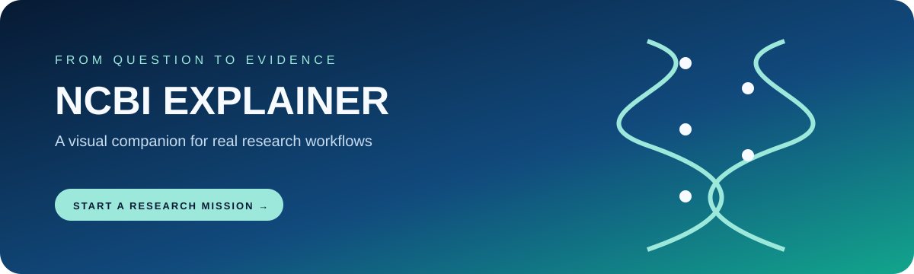

  

  <h1>NCBI INTERACTIVE EXPLAINER</h1>
  
<strong>Where scientists search the language of life.</strong>

  

    <a href="https://soheil-aghayani.github.io/ncbi/"><strong>Open the live explainer →</strong></a>
  

  

    
    
    
  

---

## The idea

NCBI Interactive Explainer turns a dense research portal into a guided visual tour. Instead of asking a new researcher to memorize a list of databases, it begins with a real-world mission and shows which NCBI tool helps answer it.

## Explore

- Literature discovery through PubMed
- Genetic variation and health with ClinVar
- DNA/RNA sequence repositories
- Protein, domain, and structure exploration
- SRA sequencing data
- BLAST-style alignment logic and result interpretation
- A visual research journey from question to evidence

## Run locally

There is no build step or dependency install:

~~~bash
git clone https://github.com/Soheil-Aghayani/ncbi.git
cd ncbi
python -m http.server 8080
~~~

Open http://localhost:8080 and choose a research mission.

## Design principle

The project is a piece of science communication: reduce cognitive load, give each database a job, and make the path from question to search result feel understandable.

  Built as a visual companion to real NCBI research workflows.

